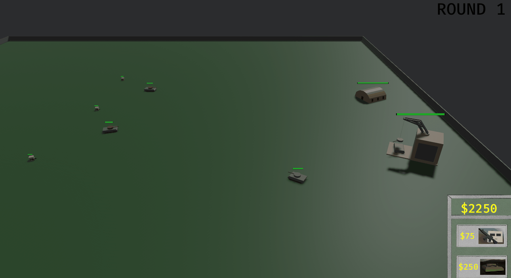
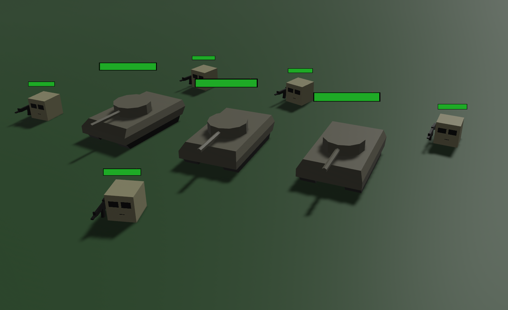
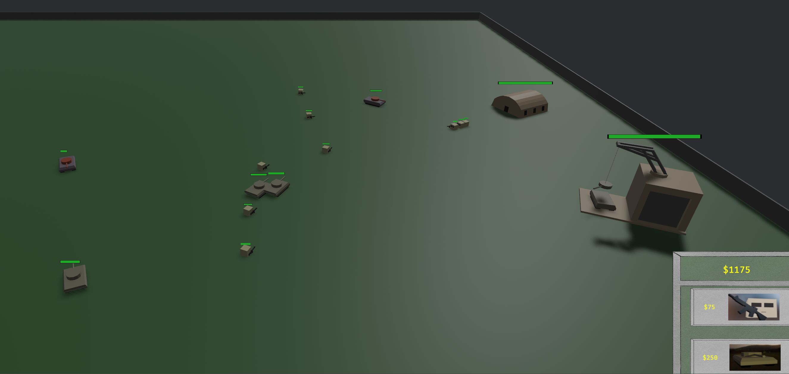
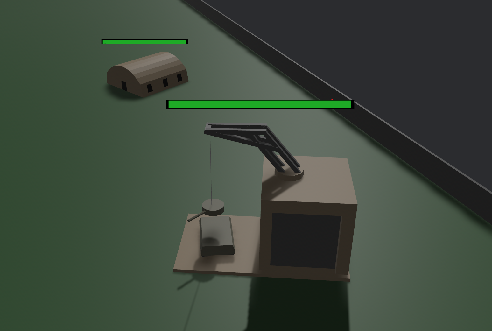
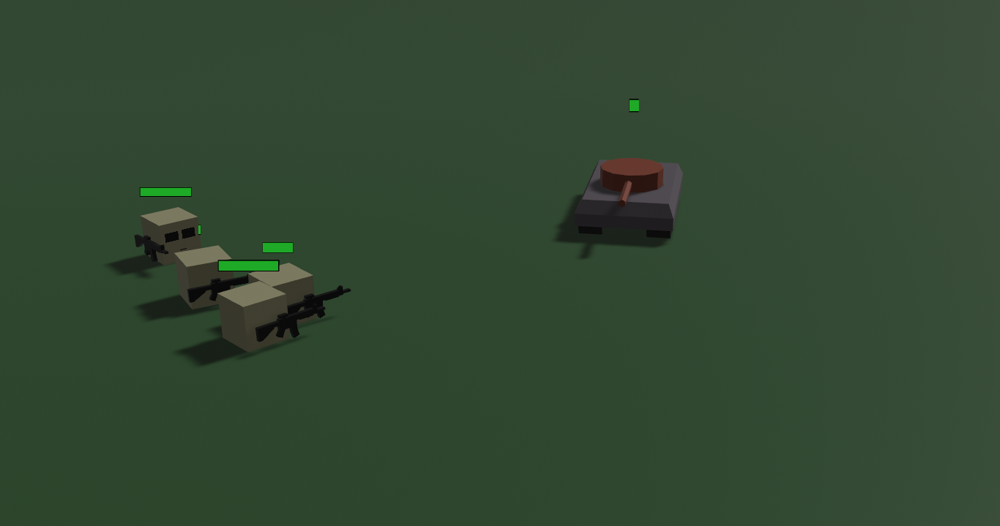

# Tank Defenders

---

Play it on [itch.io!](https://thedevblog.itch.io/tank-defenders)

## Description

This is my entry for the 07/29 Bevy Game Jam #5. Game Jam theme is *cycles*. ***Tank Defenders*** is an endless wave RTS. Spend cash to build tanks and troops. Protect your base by destroying enemies and earning more cash. Each wave spawns more enemy tanks and troops. If the enemy manages to destroy both your barracks and tank factory, you lose!

---

## Objectives

- Last as many rounds as possible
- Protect your barracks and tank factory!
- Earn cash by destroying enemy tanks and troops
- Spend cash to build tanks and troops

---

## Controls

*Gamepad unsupported

- W: pan up
- A: pan left
- S: pan down
- D: pan right
- Q: rotate left
- R: rotate right
- Select troops: single click or drag select multiple
- Move troops
- Attack Units
- Build tanks/troops with bottom right hand GUI

---

## Known Bugs

- When enemies are in firing range of your units, your units will not respond to your move commands
- Drag selecting is calculated by projecting your mouse movement onto the 3d plane of the map. This means that rotating the camera can cause some disorientation. It is easiest to control and maintain your forces from the initial starting view of the camera. This is not a fun bug.

